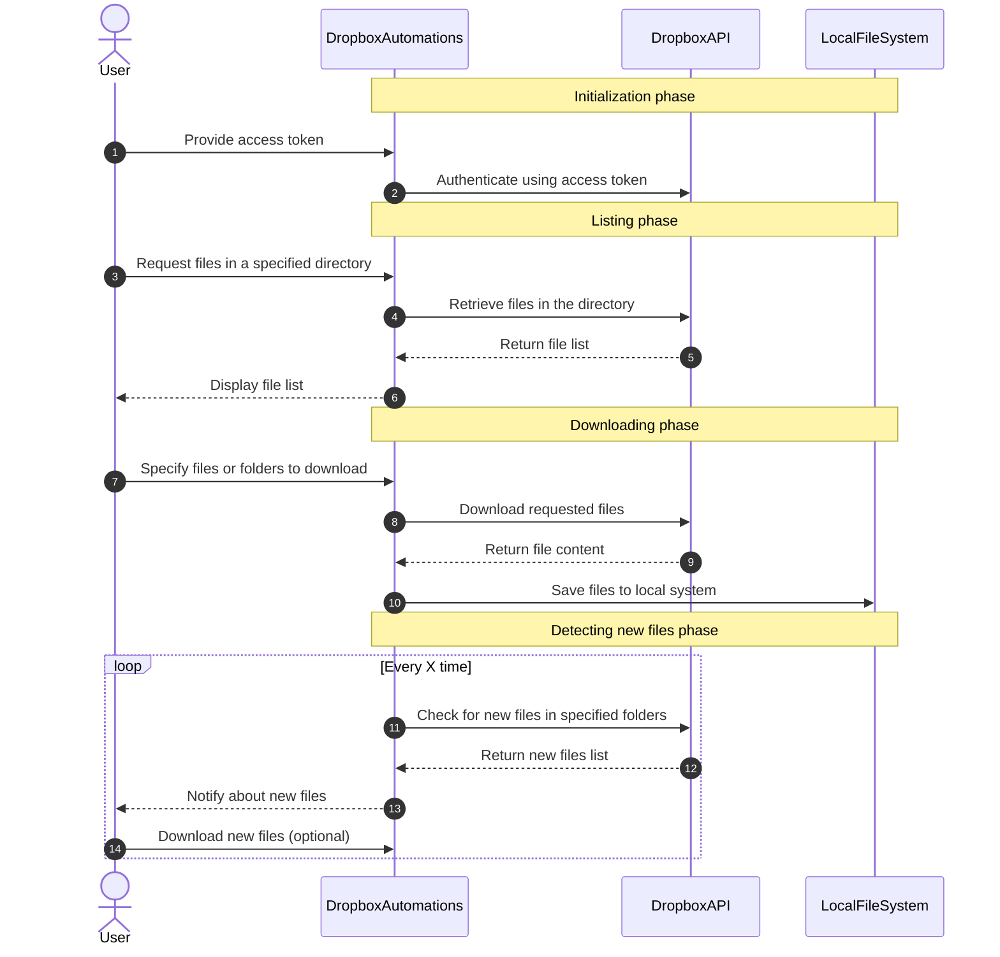

# Dropbox Automations


`dropbox-automations` is a Python-based tool designed to streamline the process of working with shared data on Dropbox. It is particularly useful in scenarios where multiple users, such as medical professionals, are collaborating on shared data, such as medical imaging files.

With this tool, users can automate various operations, such as listing files in specified directories, downloading single or multiple files from one or more folders, and keeping track of new cases that have been uploaded. The primary goal is to eliminate the need to manually navigate the Dropbox website and enable seamless access to the data via a script.

## Features
- Authenticate with Dropbox using an access token
- List available files in a given directory
- Download individual files, multiple files, or files from multiple folders
- Automatically detect and download new files that have been uploaded
- Simplify data sharing and collaboration for medical imaging or other use cases

By using `dropbox-automations`, you can easily automate your Dropbox operations and streamline the process of accessing and managing shared data, thus improving efficiency and collaboration among team members.

## Packages
- Dropbox: ```pip install dropbox```
- PyYaml: ```pip install PyYAML```
- Shutil: ```pip install pytest-shutil```

## How Dropbox Automations works

